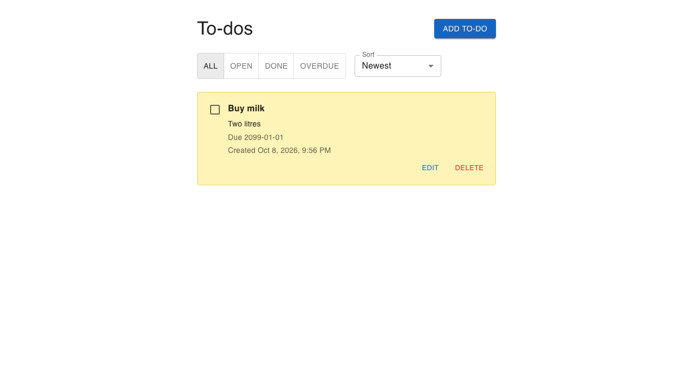

# To-Do List

REST API and a small React page for managing to-do items. The backend follows the webconf Node/TypeScript service template (Express routers, validated controllers, TypeORM models, shared error middleware) — pattern only, not a runtime dependency.

Yarn workspaces: `server/` (API) and `web/` (Vite + React + Material UI).

More UI captures from e2e: **[Screenshots](docs/screenshots.md)**.

## Live outputs

Every push to a branch builds, tests, and publishes report sites to **GitHub Pages** (`latest` plus timestamped history; non-`main` branches under `/<branch>/`).

| Output | Latest (`main`) |
| --- | --- |
| **Site index** | [valgeny.github.io/todo-app](https://valgeny.github.io/todo-app/) |
| **OpenAPI docs (Swagger/Redoc)** | […/redoc/latest/](https://valgeny.github.io/todo-app/redoc/latest/) |
| **Integration Test report (Allure)** | […/allure/latest/](https://valgeny.github.io/todo-app/allure/latest/) |
| **E2E Test report (Playwright)** | […/playwright/latest/](https://valgeny.github.io/todo-app/playwright/latest/) |

CI also uploads Allure and Playwright HTML as downloadable Actions artifacts (14-day retention). Details: [CI/CD](docs/ci-cd.md) · [Testing](docs/testing.md) · [API](docs/api.md).

## Implemented features

**API**

- Create, list, get, update fields, complete/incomplete, and delete to-dos
- List filters (`all` / `completed` / `incomplete` / `overdue`), sort, and `limit`/`offset` with `X-total-count`
- Health check at `/health`
- OpenAPI generated from Zod schemas; Postman collection for manual CRUD

**Web UI**

- One-page MUI app: create/edit dialog, yellow todo cards, Done chip + strikethrough
- Filters and sort (newest, oldest, due soonest/latest)
- FE/BE env files stay separate (`VITE_API_ORIGIN`)

**Platform**

- Local SQLite or Docker SQL Server (`todo-db` + API image)
- GitHub Codespaces / devcontainer
- MCP server (`yarn mcp`) — curated tools over the REST API ([docs](docs/mcp.md))
- Biome lint/format; Node 24; Yarn classic workspaces

**Quality**

- Integration specs under `tests/integration/` (Supertest + service tests, Allure, c8)
- E2E under `tests/e2e/` (Playwright Chromium)
- Reports and Redoc published on every push (see [Live outputs](#live-outputs))

## Install, run, and test

Requires Node.js 24+ and Yarn classic. Copy/paste commands live in the guides below — use those pages, not this summary.

| Goal | Where | CLI you will find there |
| --- | --- | --- |
| Install + env files | **[Quick start](docs/getting-started.md)** | `yarn install`, `cp …/.env.example …` |
| Run API + UI (local or Docker) | **[Quick start](docs/getting-started.md)** | `yarn dev:server`, `yarn dev:web`, `docker compose up`, `yarn dev:web:docker` |
| Run / open tests | **[Testing](docs/testing.md)** | `yarn test`, `yarn test:integration`, `yarn test:e2e`, `yarn test:*:report` |
| Run MCP tools (API must be up) | **[MCP](docs/mcp.md)** | `yarn mcp`, `yarn mcp:inspect` |
| Run in GitHub Codespaces | **[Codespaces](docs/codespaces.md)** | `yarn dev:server`, `yarn dev:web` (after Create codespace) |

## CI/CD pipeline

Full GitHub Actions pipeline — checks, artifacts, and Pages deploy.

| Stage | What runs |
| --- | --- |
| **Build** | Install, Biome lint, web build |
| **OpenAPI** | Generate OpenAPI + Redoc HTML |
| **Test** | Integration + Playwright e2e; upload HTML report artifacts |
| **Publish reports** *(push only)* | Assemble Pages site (`latest` + timestamps, branch previews) |
| **Deploy** *(push only)* | Deploy to the `github-pages` environment |
| **Linter** (PRs) | Separate reviewdog/Biome workflow with inline PR comments |

Publish/Deploy run on **branch pushes** only (`github-pages` rejects `refs/pull/*/merge`). See **[CI/CD](docs/ci-cd.md)**.

## Docs

| Guide | Contents |
| --- | --- |
| [Quick start](docs/getting-started.md) | Install, env files, run with/without Docker |
| [Codespaces](docs/codespaces.md) | Create your own Codespace; run API, UI, and tests |
| [API](docs/api.md) | Contract, Zod → OpenAPI/Redoc, Postman |
| [MCP](docs/mcp.md) | Curated MCP tools over the REST API; Inspector |
| [Testing](docs/testing.md) | Integration + e2e strategy, local and published reports |
| [Screenshots](docs/screenshots.md) | UI captures from Playwright e2e |
| [CI/CD](docs/ci-cd.md) | Workflows, Pages publish/deploy |
