# Screenshots

Captured from Playwright e2e runs (`tests/e2e/`). The intro image on the [root README](../README.md) is the create-todo happy path.

## Empty list

## Create / list

## Complete and filters

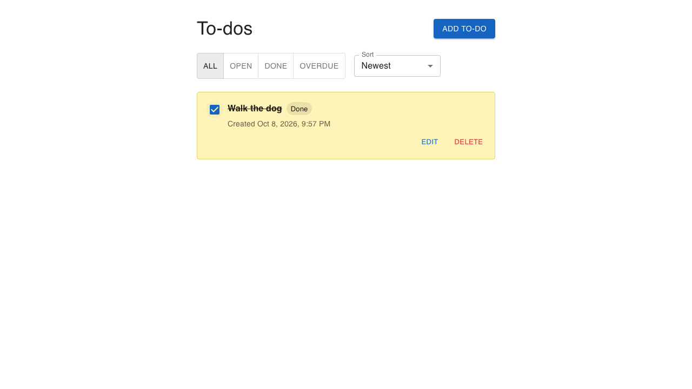

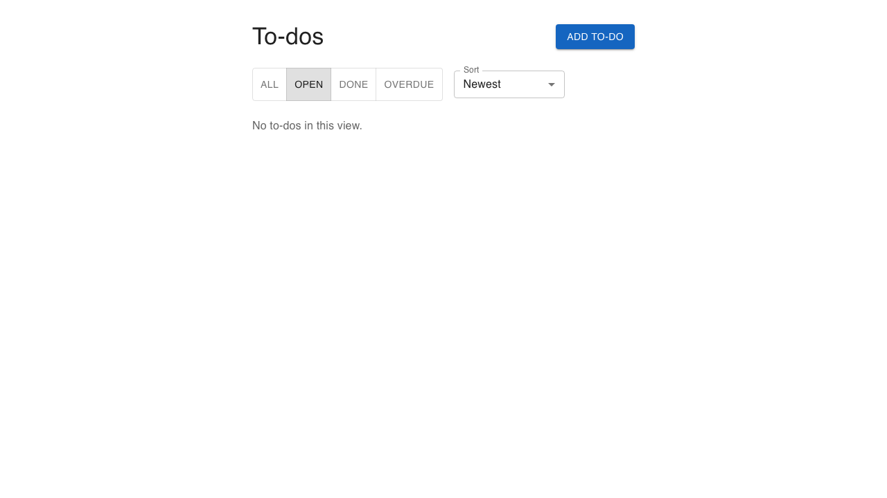

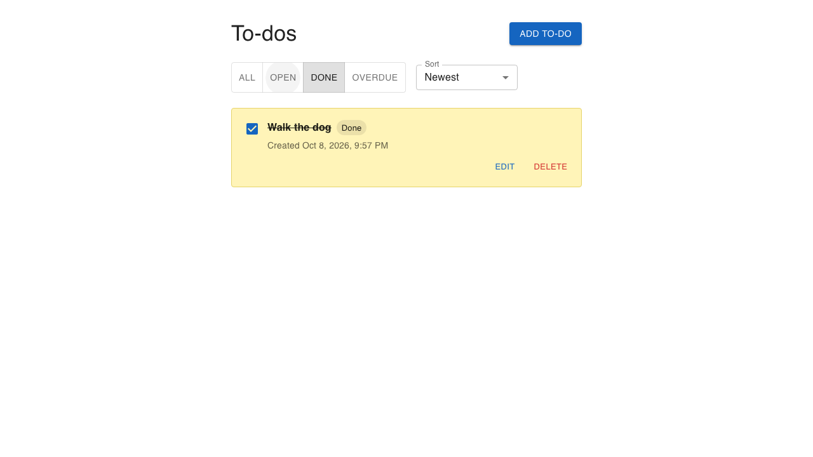

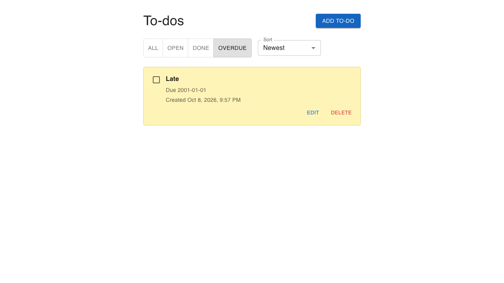

## Edit

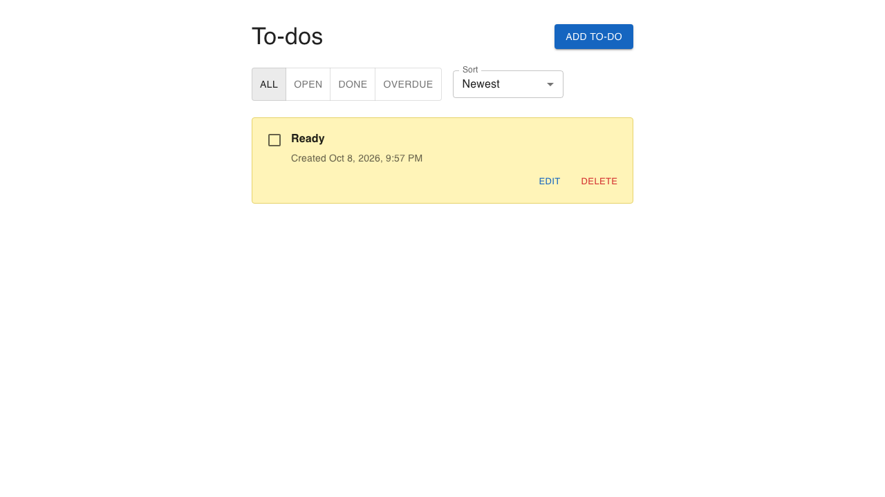

## Delete

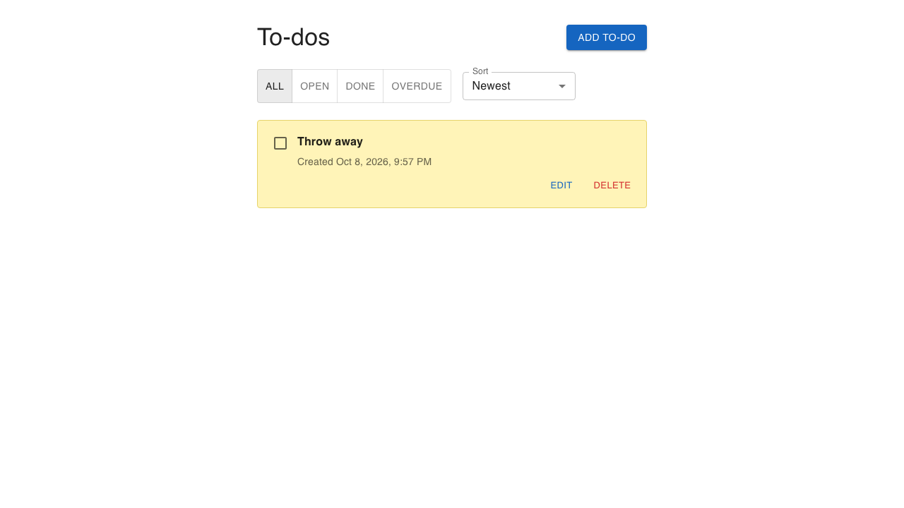

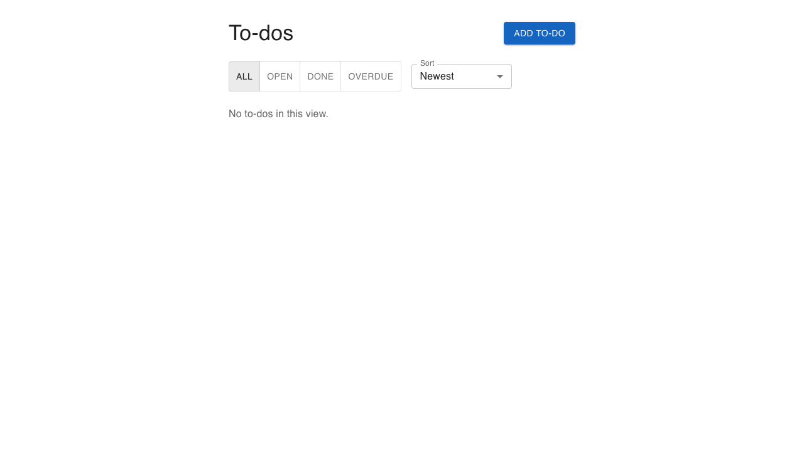

## Sort

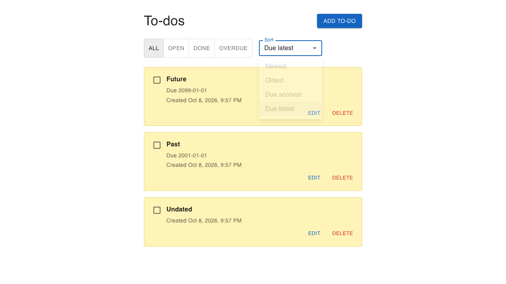

## Add dialog

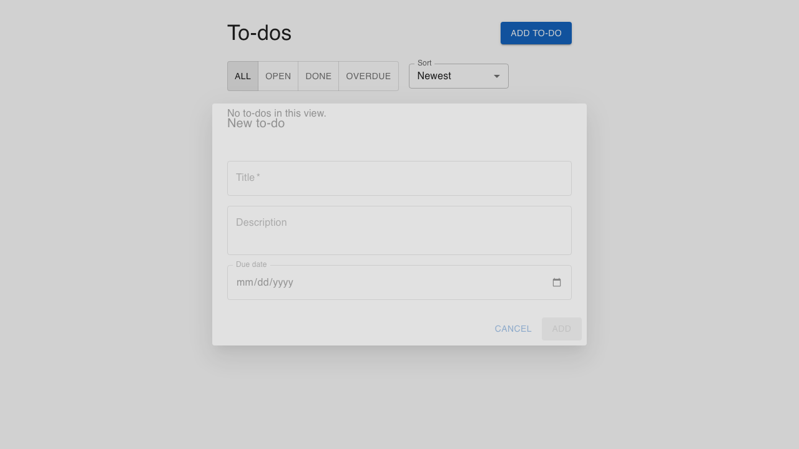

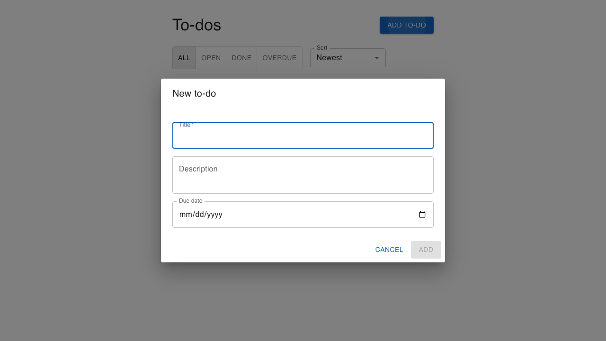

## Error state

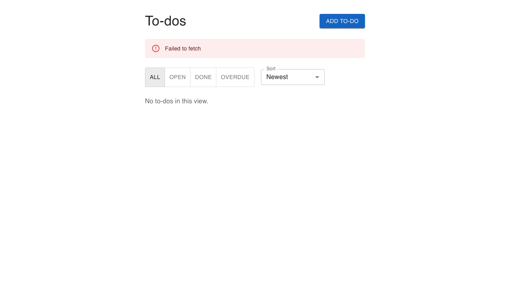
